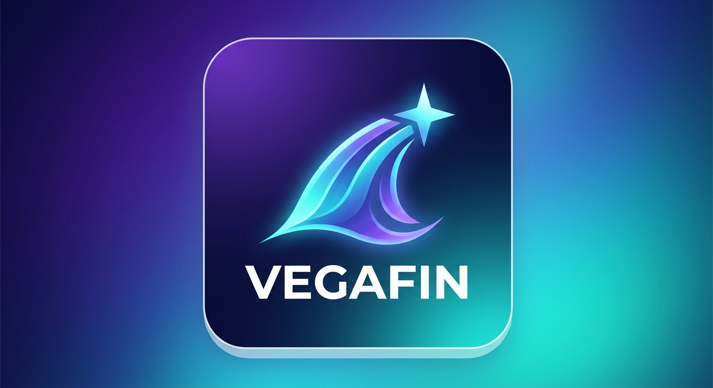

  

  

# VegaFin

**VegaFin** is a [Jellyfin](https://jellyfin.org) client built for Amazon's **Vega OS** — the
platform behind the newest Fire TV and Fire Stick devices. Point it at your own Jellyfin media
server and browse, search, and watch your movies, TV shows, and live TV, right from your TV's
remote.

> VegaFin is an independent, unofficial project. It is not affiliated with, endorsed by, or
> sponsored by Jellyfin or Amazon.

## Features

- **Movies & TV Shows** — browse your libraries with a fast, focus-driven interface built
  for the remote, rich detail pages, and a binge-friendly series view with season/episode
  browsing.
- **Pick up where you left off** — Continue Watching and Next Up rows on the home screen,
  plus an end-of-episode prompt that offers to play the next one for you.
- **Skip Intro / Skip Outro** — automatically or on request, wherever your server has that
  data available.
- **Live TV** — browse channels with a live program guide and tune in directly.
- **Search** — movies, shows, episodes, collections, and people, all in one place.
- **Multiple servers & users** — switch between Jellyfin servers or profiles in a couple of
  clicks, no need to sign out and back in.
- **Favorites**, flexible sorting, and a corner badge showing how many episodes are left to
  watch on a show you're partway through.
- **English and French**, following your device's own language automatically (with a manual
  override in Settings).
- A **Settings** screen for tuning playback behavior — skip seconds, auto-hide delay, and more.

## Getting VegaFin

VegaFin is currently under review for the Amazon Appstore — once it's published, a link will go
here.

In the meantime, you'll need:

- A [Jellyfin](https://jellyfin.org) media server that VegaFin can connect to.
- A Fire TV/Fire Stick device running Vega OS, or the Vega Virtual Device for testing.

## Building it yourself / contributing

VegaFin is open source. If you'd like to build it from source, run the tests, or contribute,
the full technical guide — architecture, platform notes, and how to get a dev build running —
lives in **[DEVELOPER.md](DEVELOPER.md)**.

## Acknowledgments

VegaFin is inspired by [Wholphin](https://github.com/damontecres/Wholphin), an Android TV
Jellyfin client, though it's an independent, from-scratch project rather than a port. Thanks
to the Jellyfin project and community for the media server this app is built around.

## License & privacy

VegaFin is licensed under the [MIT License](LICENSE). Third-party software it depends on or
bundles is covered separately - see [THIRD-PARTY-NOTICES.md](THIRD-PARTY-NOTICES.md).

VegaFin has no backend of its own; your server address and credentials go directly to the
Jellyfin server you connect it to. See the [Privacy Policy](docs/privacy.html) for details.
